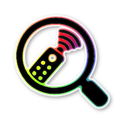
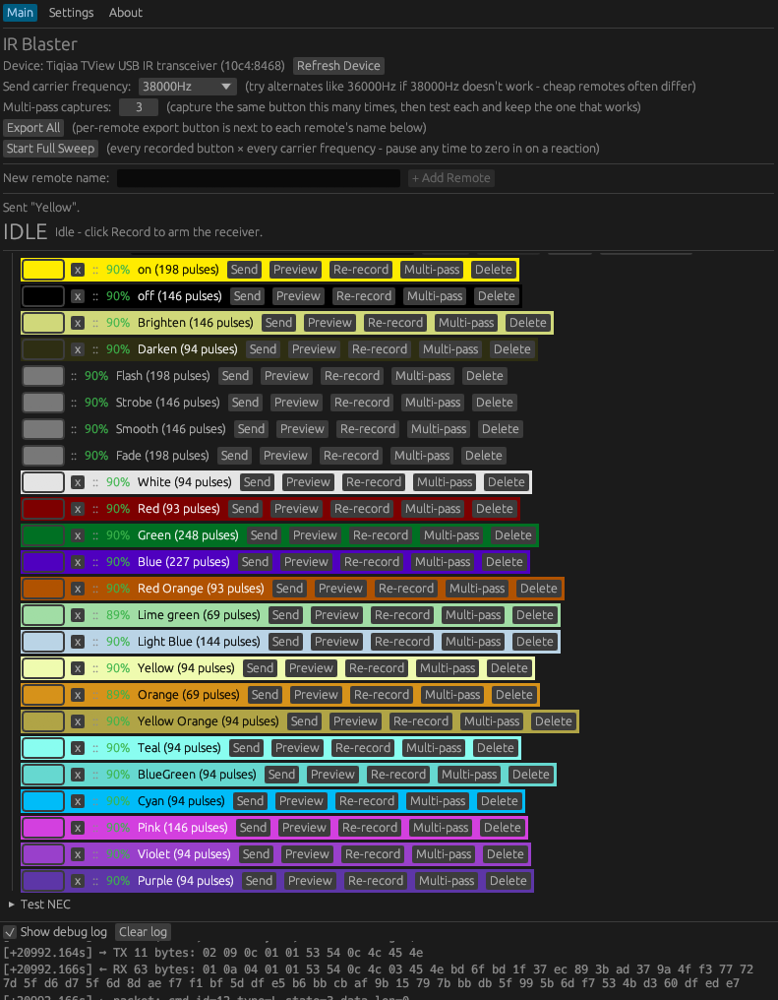
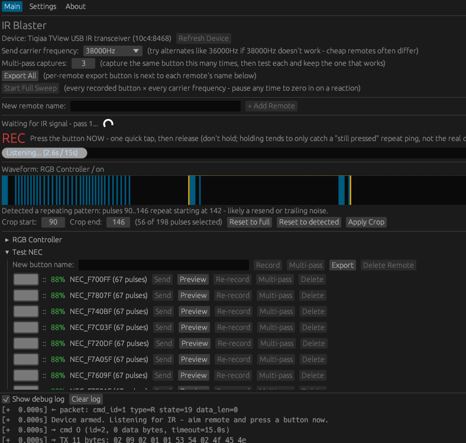
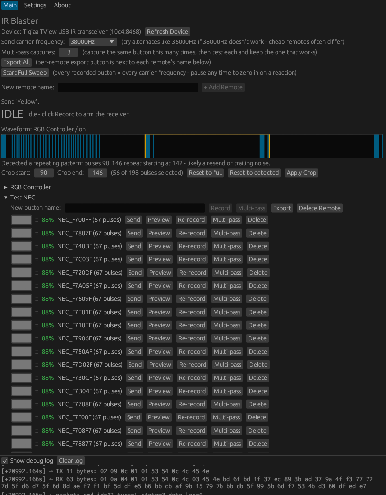

<p align="center">
  
</p>

<h1 align="center">IR Blaster</h1>

<p align="center">by <a href="https://gamedirection.net">GameDirection</a></p>

A Rust/egui desktop app for recording and replaying infrared remote signals using a **Tiqiaa TView** USB IR transceiver (also sold rebranded as ZaZaRemote, ElkSmart, and similar names; USB ID `10c4:8468`).

Point the dongle at a remote, record a button press, then replay it later to control whatever the remote controls (RGB lights, TVs, etc).



## Features

- **Record / Send** individual buttons, organized into named remotes, with drag-to-reorder and click-to-rename.
- **Live waveform preview** while listening, with a "press now" indicator.

  

- **Crop tool**: auto-detects repeating/noisy sections in a capture and lets you trim to just the real signal (draggable range, or accept the suggestion).

  

- **Multi-pass capture**: record the same button several times, then test each capture individually and keep only the one that actually works.
- **Confidence score**: a quick heuristic (0-100%) estimating whether a capture looks like a real signal or noise/an incomplete grab.
- **Carrier frequency sweep**: automatically cycle a signal through all 30 known carrier frequencies (pausable, reversible) to find the right one for remotes that don't use the common 38kHz default.
- **Color-coded rows**: pick a background color per button (with automatic text contrast) to visually group them.
- **Export / Import**: save all remotes, or just one, to a JSON file, and re-import it later.
- **Auto-update**: checks GitHub for a newer release on startup (if enabled in Settings) and installs it automatically - just restart the app to finish. A manual "Check for Updates" button is also available. Only applies to the packaged AppImage build.
- **Minimize to tray / start at login / run hidden**: run in the background with a system tray icon (Show/Quit), optionally launching automatically at login and starting hidden. Only one instance ever runs - launching again just shows the existing window.
- **Device-missing notifications**: an optional desktop notification if the IR transmitter isn't detected, throttled to at most once a day for passive checks (always fires right away if you actually try to record/send and it fails).
- **Refresh Device**: force a USB reset + reopen if the dongle stops responding.
- **Debug log panel**: every raw USB exchange, visible live, for troubleshooting.

## Requirements

- Linux with `libusb-1.0`.
- Rust (stable toolchain) - only if building from source; the AppImage release needs nothing but the dongle.
- A Tiqiaa TView-compatible USB IR transceiver (`10c4:8468`).

## Getting the app

Grab the latest `IR-Blaster-x86_64.AppImage` from the [Releases page](https://github.com/Gamedirection/master-ir-blaster/releases), mark it executable, and run it:

```sh
chmod +x IR-Blaster-x86_64.AppImage
./IR-Blaster-x86_64.AppImage
```

Or build from source:

```sh
cargo build --release
./target/release/ir-blaster
```

## Setup

Install a udev rule so the app can access the device without root. Create `/etc/udev/rules.d/99-tiqiaa-ir.rules`:

```
SUBSYSTEM=="usb", ATTRS{idVendor}=="10c4", ATTRS{idProduct}=="8468", MODE="0660", GROUP="users"
```

Then reload udev and replug the device:

```sh
sudo udevadm control --reload-rules
sudo udevadm trigger --subsystem-match=usb
```

(Adjust `GROUP` to whichever group your user belongs to, if not `users`.)

## Usage notes

- **Recording**: click "Record", wait for the "Press the button NOW" indicator, then give the remote **one quick tap** (don't hold it down) - holding tends to only capture the remote's repeat-ping, not the real command.
- **If a capture looks noisy or incomplete**: check its confidence score and the waveform preview, use the crop tool to trim it, or use Multi-pass to grab several tries and pick the working one.
- **If Send does nothing**: try the frequency sweep, and double-check the capture actually looks like a real signal (a clear leading burst, varied pulse widths) rather than a short repeating ping.
- **If the device stops responding** (times out on everything): click "Refresh Device" first; if that doesn't help, a physical unplug/replug usually clears it.

## Data storage

Remotes, exports, and settings live under `~/.local/share/ir-blaster/`. Older builds stored `remotes.json` next to the source tree instead - that gets migrated automatically the first time you run a newer build.

## Protocol notes

This device's protocol was reverse-engineered by the community (see `src/tiqiaa.rs` for references to the prior work this builds on) and isn't officially documented. Real units of this hardware are flaky in ways the reference drivers don't fully address and mode-switch commands don't reliably ack, a single `Output` request returns whatever's currently buffered rather than blocking for a real press, and the receiver doesn't cleanly demodulate the IR carrier (it emits raw carrier-rate ripple during a burst instead of one clean mark). This app works around all of that; see the comments in `src/tiqiaa.rs` for the specifics.

The implementation was cross-checked against the official vendor Android app (ZazaRemote / `com.tiqiaa.remote`) via decompilation/disassembly; USB framing, carrier-frequency table, and tick constant all matched.
